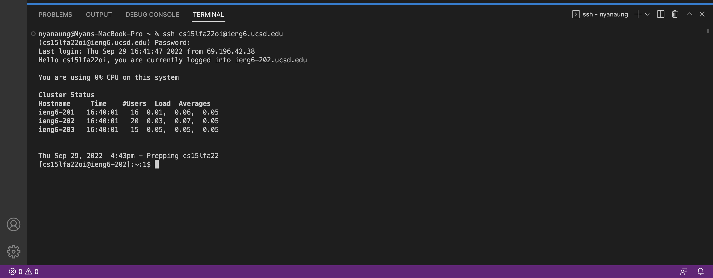
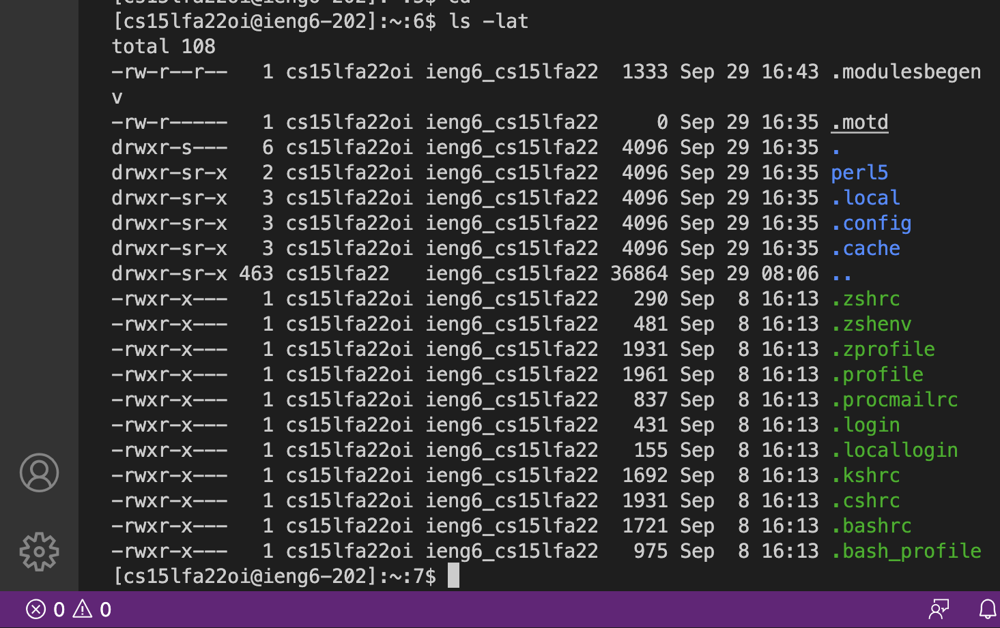
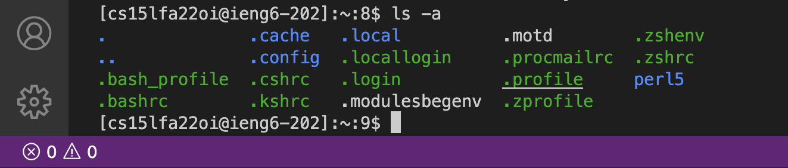
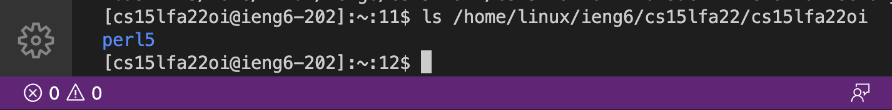
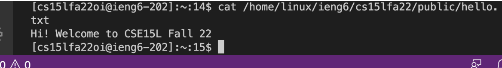
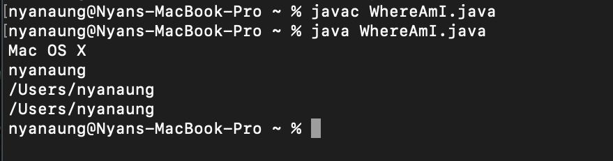
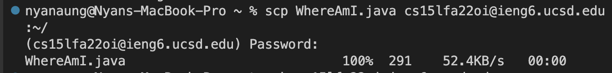
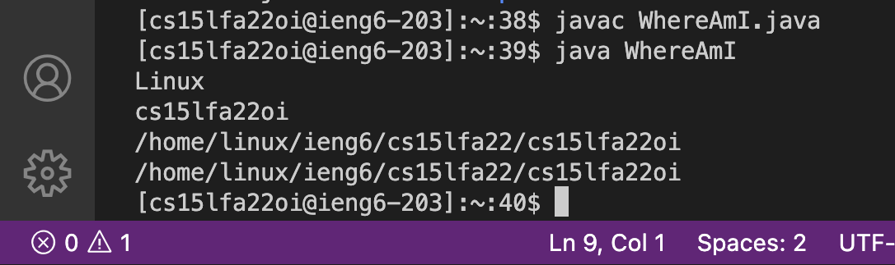
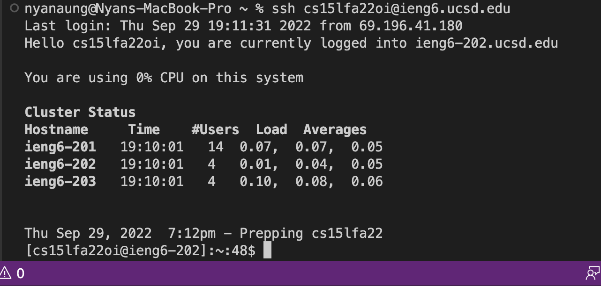
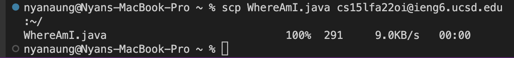

# Remote Access
* ### For CSE 15L students

## Steps: 

1. Reset the password for the course-specific account in [Course Specific Account](https://sdacs.ucsd.edu/~icc/index.php)
   * I did not need to reset it since I did it for another class last week Sunday. 

2. I downladed and installed Visual Studio Code (VS Code) from [Download Visual Studio Code](https://code.visualstudio.com/) 
   * Since I installed VS Code last week, here's an image of my VS Code home page  

3. Using the teminal from VS Code I typed in : 
    1. `ssh cs15lfa22oi@ieng6.ucsd.edu` 
    2. Then my password
    * To log into the remote server using my computer 

4. I tried out various commands using the remote server: 
    * `cd ~` and `cd`
       * Both `cd` and `cd ~` can be used to go back to the home directory.
       * No result because I was already at the home directory. 
    * `ls -lat` 
       * use to list files in the directory with detailed information such as path and time created.
       * 
    * `ls -a`
       * Use to show the list of files in the directory, including the hidden files.
       * 
    * `ls /home/linux/ieng6/cs15lfa22/cs15lfa22oi`
       * show file from the path.
       * 
    * `cat /home/linux/ieng6/cs15lfa22/public/hello.txt`
       * Prints out hello.txt file.
       * cat command prints out files 
       * 

5. Then I created `WhereAmI.java` file in VS Code and ran it on my computer.
   * 
   * Output is Mac Os X, my name and the user directory

6. Using scp command to transfer WhereAmI.java file from my computer to the ieng6 server.
   * Steps: 
    1. In the terminal of the your computer type in scp.
    2. Follwed by the name of the file you want to transfer. In my case it's `WhereAmI.java`
    3. Then input the server that you want to transfer to. In my case 'cs15lfa22oi@ieng6.ucsd.edu'
    4. It is also important to put `:~/` at the end of the command. 
    5. Hit enter.
    6. Type in the password for your ieng6 server. 
    7. Then you will see that `WhereAmI.java` is 100% transferred with 52.4KB/s. 
   * 
   * Running scp command in the ieng6 server 
   * The output now shows Linux, my username, both home and user directory of the remote computer
 
7. Then I setup ssh key to save time from using my password everytime I use ssh or scp.
   1. input `ssh-keygen` in my computer terminal to create public key and private key. Then folow the steps and do not enter the password in the last step. 
   2. Log into the server account using passwrod.
   3. Input `mkdir .ssh` in your server. Then log out. 
   4. On the computer terminal input `$ scp /Users/nyanaung/.ssh/id_rsa.pub cs15lfa22io@ieng6.ucsd.edu:~/.ssh/authorized_keys`
   * ssh without password: 
   * scp without password: 

8. I also tried some shortcuts to optomize remote running as well: 
   * Use "" at the end of ssh to commmand it directly from the computer and not in the server. 
      * `ssh cs15lfa22@ieng6.ucsdoi.edu "ls"`
   * Use multiple commands in one line. 
      * `cp WhereAmI.java OtherMain.java; javac OtherMain.java; java WhereAmI`
    

       
