# Lab Report 4 (Vim)

## Part 1

Task Chosen: 
* Changing the name of the `start` parameter and its uses to `base`

* Command Used:  
   `:%s/start/base/g`  
    `<Enter>`  
    `lllllll`  
    `dw`  
    `<Enter>`  
    `i`  
    `start`  
    `<Esc>`  
    `:wq`  
    `<Enter>`     
  * The `:%s/start/base/g` is the substitute command that I found in vimtutor lesson 4.It not only replaces all the `start` to `base` in one command, it is also very efficient since I don't have to go through the words one by one to change them. 
    
 * This is the screenshot before the command changing `start` to `base`, but I have already typed in the command. 
    * 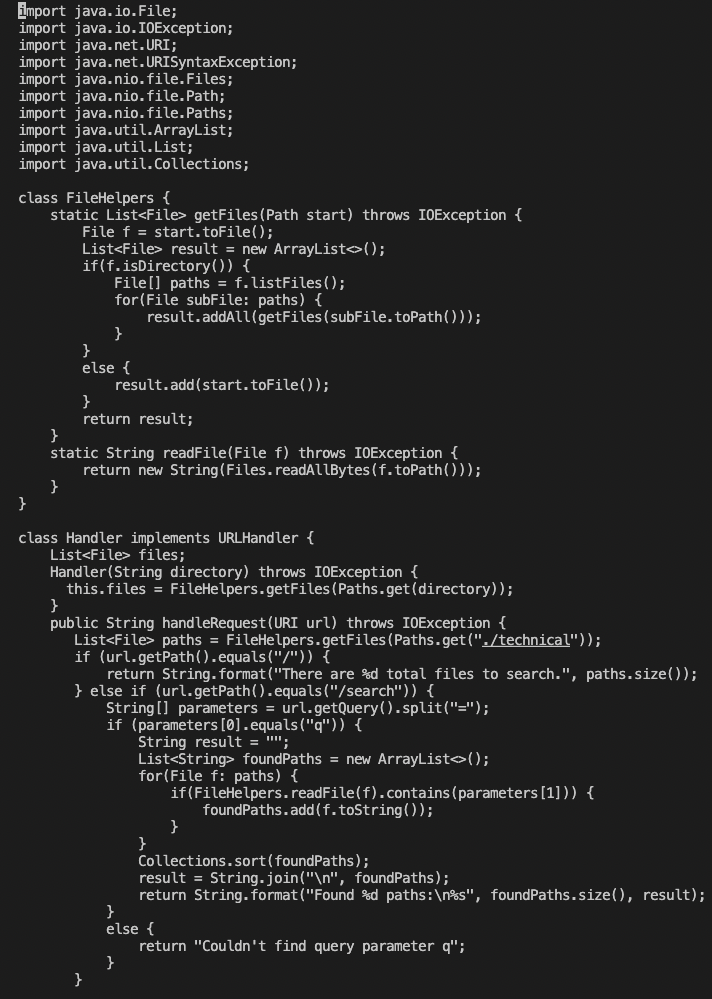 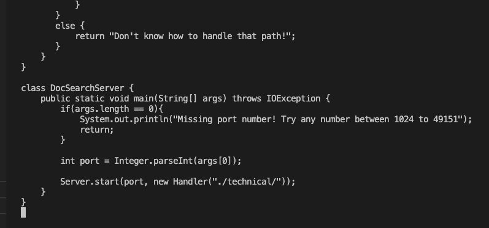

* Screenshot of using `:%s/start/base/g` command : 
    * 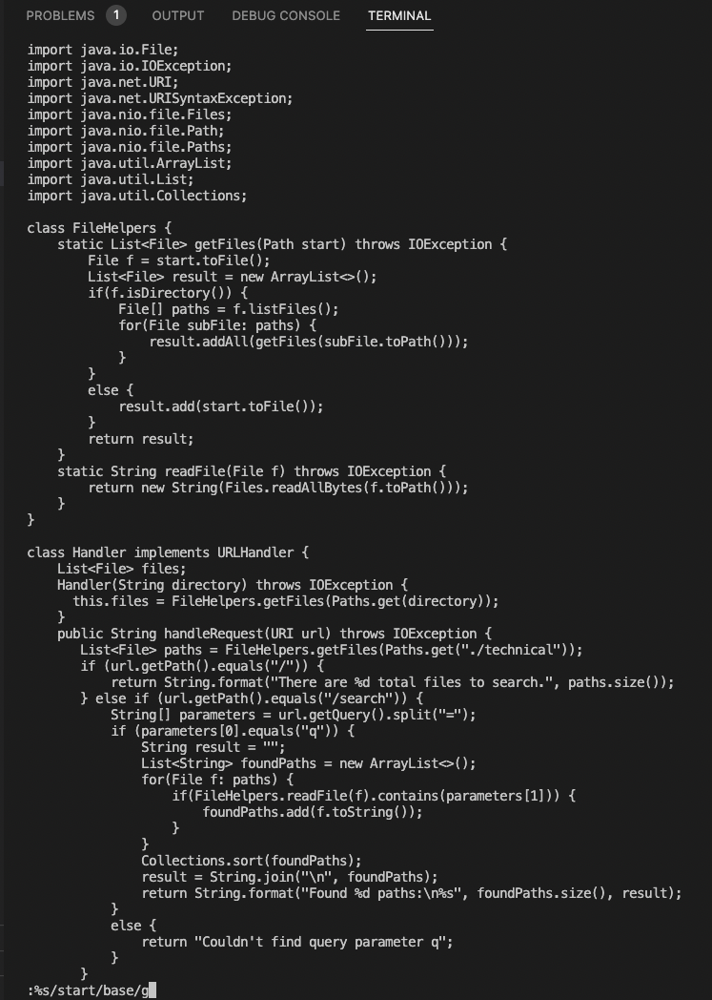 

* Screenshot after using `:%s/start/base/g` command: 
    * 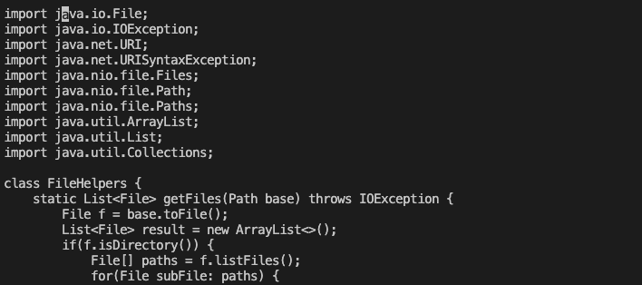 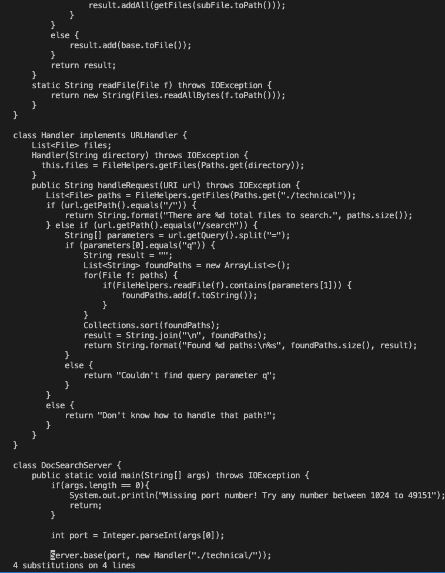

* Screenshot of moving 7 places to the right by typing 'l' key 7 times.
    * 

* Screenshot of deleting 'base' word by using `dw` command.
    * 

* Screenshot of using `i` command to insert.
    * 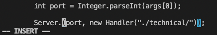

* Screenshot of replacing `base` with `start` and using Esc key to get out of insert mode
    * 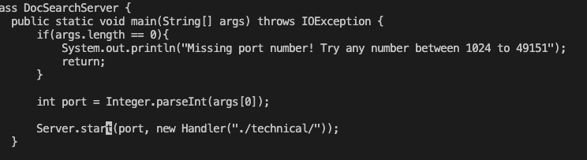

* Screenshot of saving the file using `:wq`
    * 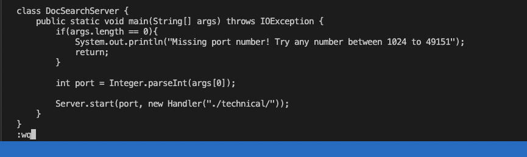

* A total of 16 key presses to complete the task. 

## Part 2

### 1st metod
* Changing `start` parameter to `base` in DocSearchServer.java file
    * 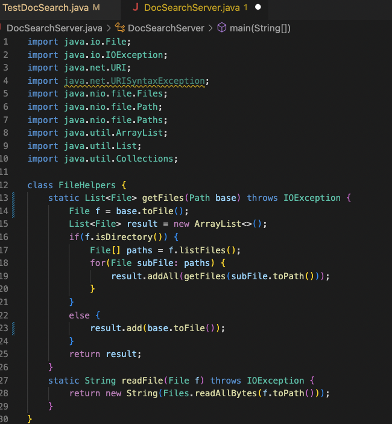

* Transfer file to ieng6 server using scp
    * 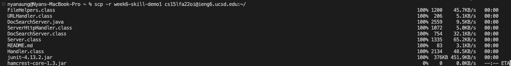

* Ssh into remote server
    * 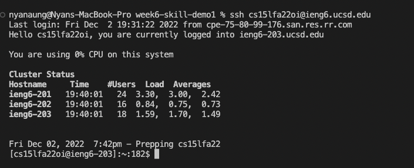

* Run `bash test.sh` in ieng6 server
    * 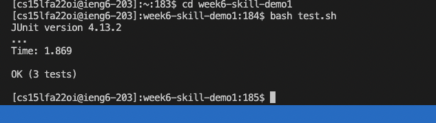

* I took about 7 minutes and 37 seconds to complete the whole process since the file transfer was taking a long time. 

### 2nd Method
* Open DocSearchServer.java using vim to edit in vim. 
    * 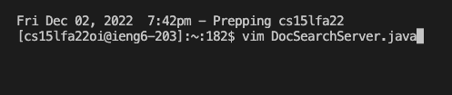
    * Screenshot of opened DocSearchServer.java in vim. 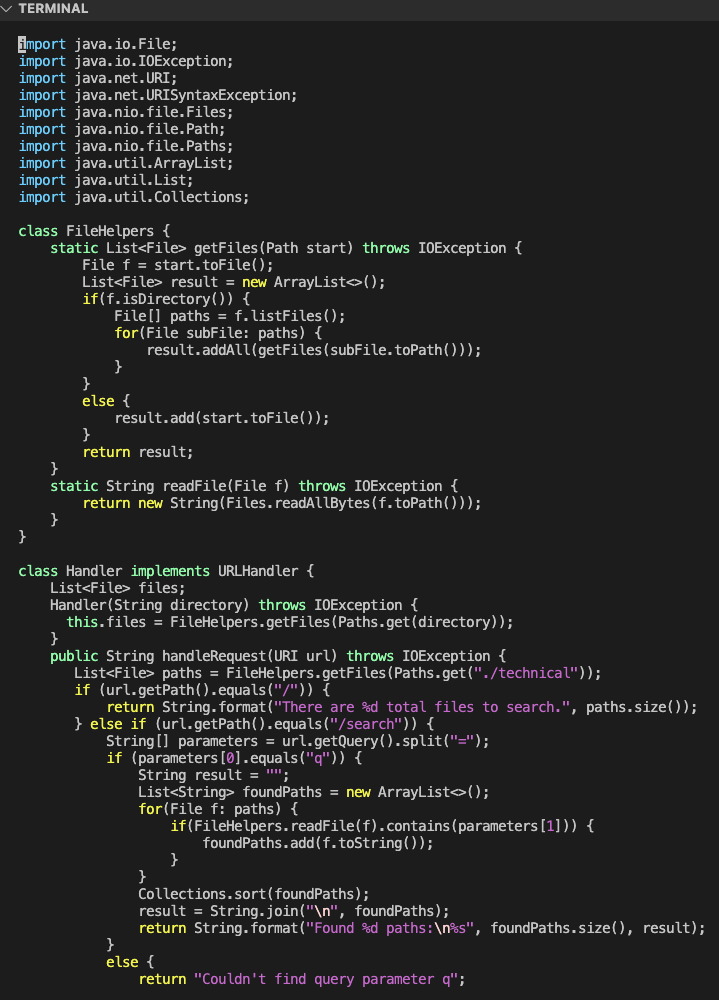

* use `:%s/start/base/g` to replace all `start` with `base`.
    * 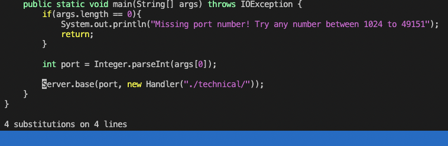

* Replace `base` with `start` in DocSearchServer class and save the file. 
    * 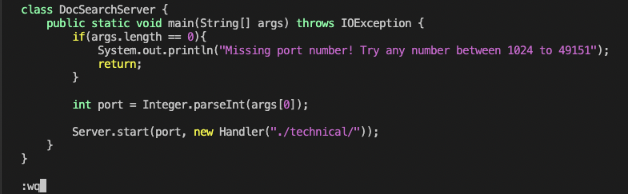

* Go into week6-skill-demo1 repository using `cd week6-skill-demo1`.
    * 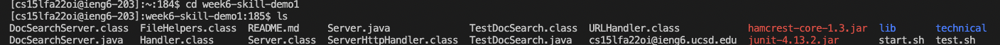

* Run `bash test.sh in the ieng6 server`.
    * 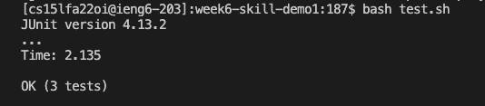

* This whole process took me around 2 minutes 23 seconds. I did not have any problems or difficulties this time around. 

### Questions
1. Which of these two styles would you prefer using if you had to work on a program that you were running remotely, and why?

* If I have to choose between the two methods for running the program remotely, I would prefer the vim method since I can edit the program while I'm still in the remote server and I don't need to transfer files, I can just edit in vim and save it using vim in the remote server. Moreover, it takes a long time transfer the file using scp if the program that you are working on is very big. Hence, vim would save a lot of time since we do not need to transfer files.  

2. What about the project or task might factor into your decision one way or another? (If nothing would affect your decision, say so and why!)

* I would still choose vim since I really like the shortcut commands that they have. Moreover, using vim is a lot more efficient because of these commands as well. For instance, if we have to replace a word that repeat in the program about 100 times instead of 4 times, using the `:%s` command would be a great help in being efficient since we would not have to go thorugh the program to change the words one by one. Although I do not know a lot of vim shortcuts, I believe that there are more commands that can help with the efficiency in writing and editing programs. 

