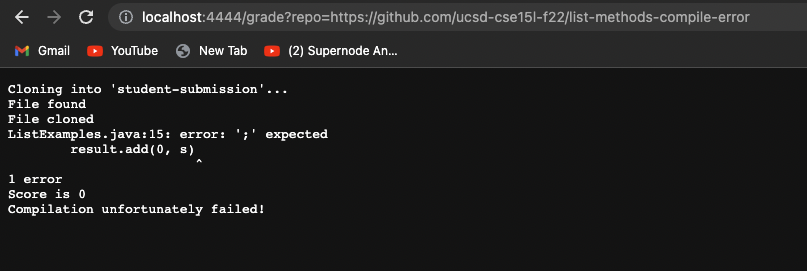
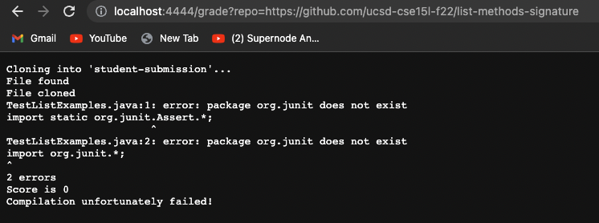
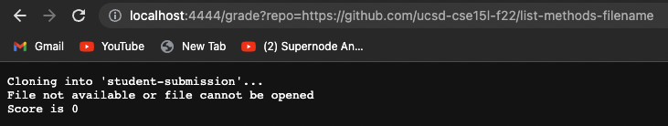

# Lab Report 5 (Grade Server)

### Code Block
``` 
#Create your grading script here

set -e

#CPATH = ".:lib/hamcrest-core-1.3.jar:lib/junit-4.13.2.jar"

rm -rf student-submission
mkdir student-submission
git clone $1 student-submission

cd student-submission/

FILE=ListExamples.java

if [[ -f "$FILE" ]]
then
        echo "File found"
        echo "File cloned"
else
        echo "File not available or file cannot be opened"
        echo "Score is 0"
        exit
fi

cp ../TestListExamples.java ./

set +e

SCORE=0

javac -cp ".;../lib/*" ListExamples.java TestListExamples.java

if [[ $? -eq 0 ]]
then
  SCORE=$(($SCORE+1))
  echo "Score is " $SCORE ""
  echo "Compilation is a success!"
else
  echo "Score is" $SCORE ""
  echo "Compilation unfortunately failed!"
  exit
fi

FAILED=$(java -cp ".;../lib/*" org.junit.runner.JUnitCore TestListExamples | grep -oP "(?<=,  Failures: )[0-9]+")

if [[ $? -eq 1 ]]
then
  SCORE=$(($SCORE+2))
  echo"Score is" $SCORE " "
else
  SCORE=$(($SCORE+2-$FAILED))
  echo"Score is" $SCORE " "
fi

``` 

### 3 Examples

1.  https://github.com/ucsd-cse15l-f22/list-methods-compile-error, which has a syntax error of a missing semicolon. 


2. https://github.com/ucsd-cse15l-f22/list-methods-signature, which has the types for the arguments of filter in the wrong order, so it doesn’t match the expected behavior.


3. https://github.com/ucsd-cse15l-f22/list-methods-filename, which has a great implementation saved in a file with the wrong name.



### Trace the script

Screenshot used: 

 ```
if [[ -f "$FILE" ]]
then
        echo "File found"
        echo "File cloned"
else
        echo "File not available or file cannot be opened"
        echo "Score is 0"
        exit
fi
 ```
 * Standard ouput for this command was if the file was found and cloned. While the standard error for this command was if the file was not found. The return code is nonzero.

 * In this case, the if statement was true since there is a file to be found in the repository. 

 ```
if [[ $? -eq 0 ]]
then
  SCORE=$(($SCORE+1))
  echo "Score is " $SCORE ""
  echo "Compilation is a success!"
else
  echo "Score is" $SCORE ""
  echo "Compilation unfortunately failed!"
  exit
fi
 ```
* This if statement is false since there is a semicolumn missing in the code of the repository. Hence, the compilation will unfortunately fails. 

```
if [[ $? -eq 1 ]]
then
  SCORE=$(($SCORE+2))
  echo"Score is" $SCORE " "
else
  SCORE=$(($SCORE+2-$FAILED))
  echo"Score is" $SCORE " "
fi
```
* This if statement does not run