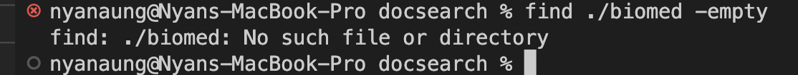
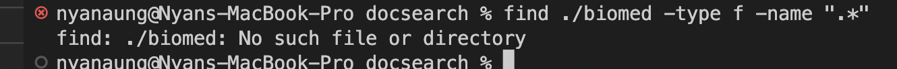

# Researching Commands

## Command Researched: find

### 1. Search for empty files in the directory
`-empty` finds the empty folders or files in the directory. It can be very useful whne we are trying to organize or offload the directory that we have. 

There is no output in the above two screenshots because there are no empty files in the directories.

Error!! because ./government is not a directory. 

### 2. Searching for files using the name
`name` can be used to find the specific file typing out its name. It is especially useful if you want to access or check if the file is avaliable within the directory. 

### 3. Finding for hidden files
`".*"` can be used to find the hidden folders in directory. This is especially useful when you are planning to check if the directory is not the one that you created or can even be checked if you forget if you had any hidden files in the directory. 

There is no output in the above two screenshots because there are no hidden files in the directories.

Error!! because ./biomed is not a directory. 
