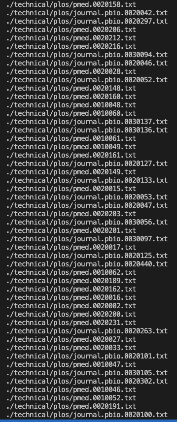

# Researching Commands

## Command Researched: find

### 1. Finding files based on size
`-size` can be used to find files based on how big or small they are. 

* Using -size and adding +20k to find the files that are bigger than 20KB.

* Using -20k to find files that are smaller than 20KB. 

* Using +200k to find files that are bigger than 200KB.

* You can use `c` for bytes, `k` for kilobytes, `M` for Megabytes, and `G` for Gigabytes as well.

### 2. Searching for files based on recently modified files

`-mtime`, `-ctime`, and `-atime` can be used to see which file you last modified or accessed to.

* `-mtime` can be used to find all of the files that were modified within a certain period of time. For instance, -5 means within 5 days. Below screenshot is showing the files that I have modified to in the last 5 days. 

* `-ctime` can be used to find all the files that were created within a certain period of time. Below screenshot is showing the files that I had newly created within the last 4 days.
 

* `-atime` can be used to find all the files that you have accessed within a certain period of time. Below screenshot is showing the files that I had accessed to in the last 3 days.

As you can see there are a lot of files since I had curiously gone through many of the files in the ./technical directory.

* `-mmin` can be used to find all the files that I had modified within the certain amount of minutes. For instance, -10 means within 10 minutes. Below screenshot is showing the files that I had modified within the last 10 minutes.

* `amin` and `cmin` can be used to find the files that I have accessed to and created within a certain minute respectively as well. 

### 3. Searching files by their extensions
`-type` can be used to find files based on their specfic file type or extension. For instance, text files can be searched using `.txt` while `.cpp` can be used to search for C++ files. 

* Using `-type` and `*.cpp`. I can find the C++ file that I had created earlier to test the command for the lab. 

* Using `-type` and `*.java`. I can find the Java file that I had created earlier to test the command for the lab. 

* I also tested out with `*.txt` command to search for all the txt files that exist in the ./technical directory.

* However since there are too many txt files that exist in the directory, I couldn't capture all of the txt files in the screenshot. 

